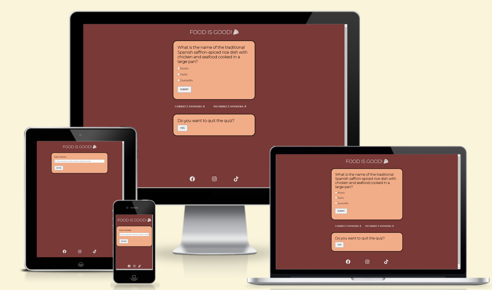
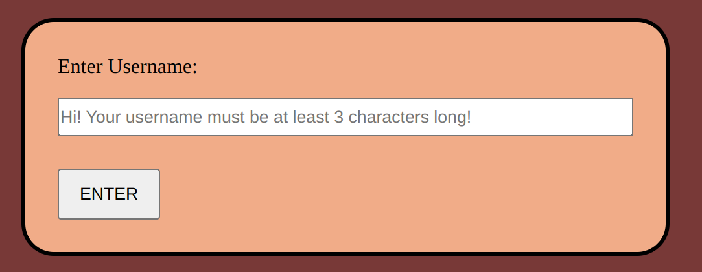
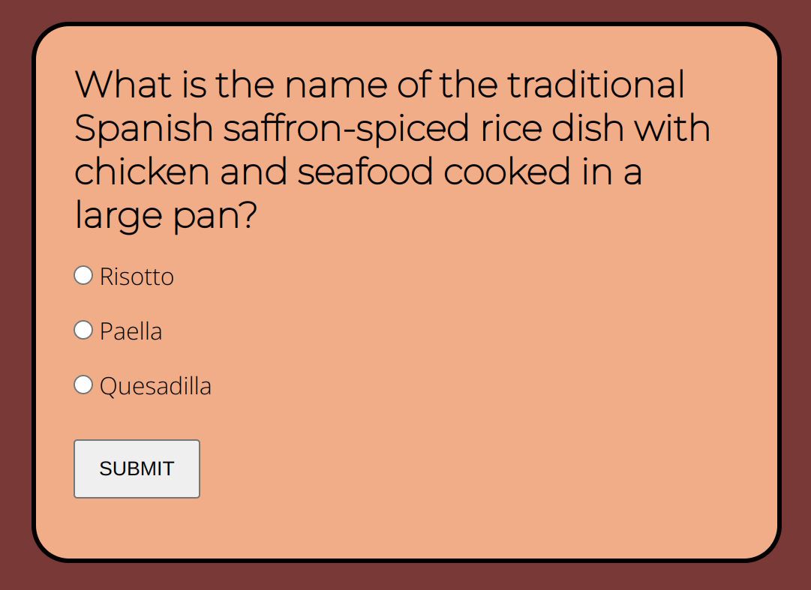
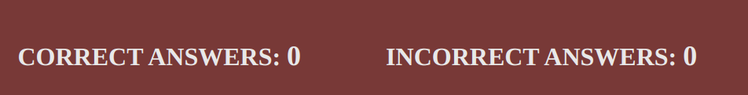
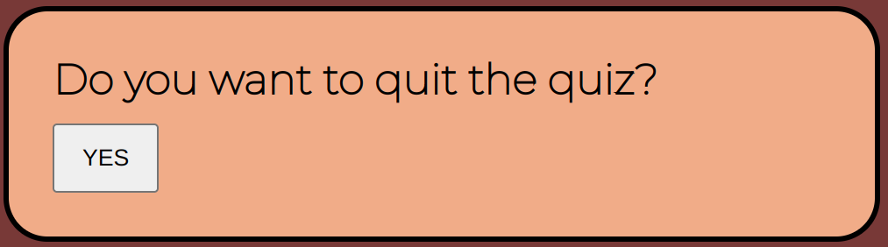
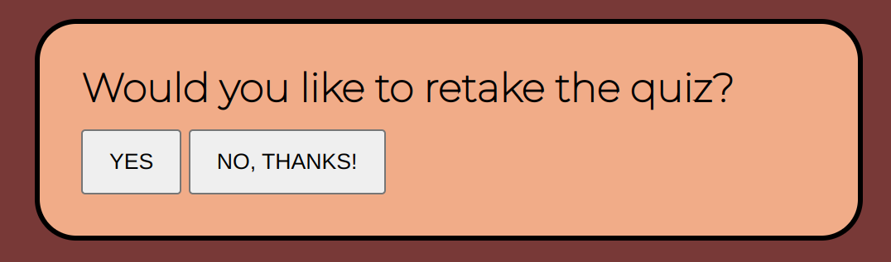
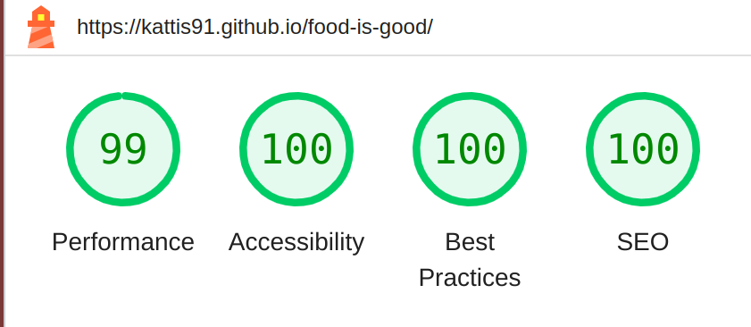

# FOOD IS GOOD

Food is good is a website that contains a quiz with food-related questions. The quiz can be fun for both foodies and beginners.

## Wireframes

Wireframes were done with the help of [Figma](https://www.figma.com).

 - Username and quiz pages for [desktop](https://github.com/Kattis91/food-is-good/blob/main/assets/images/readme-images/wireframes-desktop.jpg).

 - Username and quiz pages for [mobile](https://github.com/Kattis91/food-is-good/blob/main/assets/images/readme-images/wireframes-mobile.jpg).

## Features

### Heading

- Grabs attention and speaks for itself. Now everybody knows what the quiz is about.

- The pizza font is added for an even more colorful imprint.
There aren't many people who don't like pizza, right?

### Username Form

- This section allows users to enter a username before starting a quiz.

- It gives users information about how long a  username should be to get approved.

### Quiz

- Every quiz page contains a question, three answer options, and a button to submit the selected answer.

- After users submit the answer, the next question appears on the screen.

### Score Area

- This section shows correct and incorrect answers. Their value is set to 0.

- If a user answers correctly, a point is added to correct answers area.

- If a user answers wrong, a point is added to incorrect answers area.

### Quit area

- This section gives user an option to end the quiz at any time.

- Clicking on the YES button will take the user to the page with the username form.

### Next step

- This page appears when the user is done with all the quiz questions.

- The user gets an opportunity to retake the quiz for better results.

- The user can also choose to exit the quiz.

## User Experience (UX)

### Key Project Goal

The site aims to offer a simple but still challenging quiz about food. The number of questions is low, so it goes quickly and smoothly to participate and doesn't take too much time from the user's everyday life. 

The future goal is to be able to offer other theme quizzes.

### Target Audience

The quiz can be fun for both foodies and beginners. In other words, for everybody who wants to test their knowledge or learn something new about food.

### User Stories

#### As a site visitor I want to be able to:

  - Easily enter a username.
  - Get information about what went wrong if the chosen username doesn’t get approved.
  - Easily answer quiz questions.
  - Directly see if the answer was right or wrong.
  - Retake the quiz any time I want. 
  - Quit the quiz any time I want.
  - View the site on a range of device sizes. 

## Testing

In order to thoroughly test my website, I conducted a series of tests on various browsers including Google Chrome, Safari, and Mozilla Firefox. I also tested on multiple devices such as iPhone XS, iPhone 13 mini, iPhone SE, and Samsung Galaxy S10.

I used Google Chrome developer tools to confirm responsiveness on various screen sizes.

### Manual Testing

| Feature | Expect | Action | Result | Pass/Fail |
|---------|--------|--------|--------|-----------|
| Enter Username | When trying to click on the enter button without filling in any username, the user should get an ":exclamation: Please fill out this field" error message | Click on the enter button without filling in any username | The ":exclamation: Please fill out this field" error message appears when the username field remains blank | Pass |
| Enter Username | When trying to enter a username with less than 3 characters, the user should get a “Ooops..Please note that the username must consist of at least three characters!” error message | Try to enter a username that has less than 3 characters | The “Ooops.. Please note that the username must consist of at least three characters!” error message appears on the screen | Pass |
| Enter Username | When entering an approved username, the user should be welcomed to the quiz, and the quiz box, score area and the quitting box should appear on the screen | Enter a username that consists of 3 or more characters, and click on the enter button | “Welcome to the food quiz! Hi ‘_your entered username_’! Happy to see you here! The quiz consists of 6 questions, and you can quit the quiz any time you want!” information message appears on the screen. The quiz box, the score area and the quitting area appears on the screen and got placed behind the information message. They become fully visible after clicking on OK-button | Pass |
| Choose an answer | When a user chooses an answer and clicks on the submit button, the next question should appear on the screen | Choose an answer and click on the submit button | Next question appears on the screen | Pass |
| Selecting the correct answer | When a user selects the correct answer, one point should be added to the area with correct answers | Select the correct answer and click on the submit button | The correct answers area got increased by one point | Pass |
| Selecting the wrong answer | When a user selects the wrong answer, one point should be added to the area with incorrect answers | Select the wrong answer and click on the submit button | The incorrect answers area got increased by one point | Pass |
| The quitting area | When clicking on YES-button in the "Do you want to quit the quiz?" area, a user should be taken to the first page where it is possible to enter a username | Click on the YES-button in the "Do you want to quit the quiz?" box | The page with the username form appears on the screen | Pass |
| Answering the last question | When answering the last question of the quiz, a user should come to the page that asks if the user wants to retake the quiz. The user gets two alternatives: “Yes” and “No, thanks!” | Select an answer to the last question and click on the submit button | “Would you like to retake the quiz?”-question appears on the screen with two alternatives (“Yes” and “No, thanks!”) | Pass |
| “Yes”-alternative | When clicking on “Yes”, the user should be taken to the first question of the quiz | Click on YES-button | The first question of the quiz appears on the screen | Pass |
| “No, thanks!”-alternative | When clicking on “No, thanks!”, the user should be taken to the first page where it is possible to enter a username | Click on NO, THANKS!-button | The page with the username form appears on the screen | Pass |

### Validator Testing

- CSS
  - No errors were found when passing through the official [Jigsaw Validator](https://jigsaw.w3.org/css-validator/validator)
- HTML
  - No errors were found when passing through the official [W3C Validator](https://validator.w3.org/)
- JavaScript
  - No errors were found when passing through the official [JSHint Validator](https://jshint.com/)
  - Validator gave warnings about one undefined variable(Swal) and one unused variable (retakeQuiz).
  

### Lighthouse

I used Lighthouse within the Chrome Developer Tools to test the performance, accessibility, best practices and SEO of the website.

## Credits

### Media

- An image used for a favicon was downloaded from [Usplash](https://unsplash.com/photos/MJPr6nOdppw).

- [Favicon Generator](https://favicon.io/favicon-converter/) was used to generate a favicon from the image.

- The color combination was taken from the article "26 beautiful color combinations that'll inspire your next design" posted on [Webflow](https://webflow.com/blog/best-color-combinations).

### Content

- Instructions on how to make a quiz using JavaScript are taken from:
  - YouTube:
    - [Create a Quiz App using HTML CSS & JavaScript | Quiz Web App using JavaScript](https://www.youtube.com/watch?v=CqddbIrEM5I&t=994s).
    - [How To Make Quiz App Using JavaScript | Build Quiz App With HTML CSS & JavaScript](https://www.youtube.com/watch?v=PBcqGxrr9g8).
  - Articles:
    - [Foolish Developer. Simple Quiz App Using JavaScript & HTML (Free Code)](https://foolishdeveloper.com/javascript-quiz-app/).
    - [Sitepoint. How to Make a Simple JavaScript Quiz](https://www.sitepoint.com/simple-javascript-quiz/).

- The code that is used to build the score area and functions that are used to increase both score and amount of wrong answers are borrowed from Love Maths Project. 

- [Google Fonts Site](https://fonts.google.com/) was used to import the fonts used on the website.

- Instructions on how to add a favicon in HTML are taken from [W3Schools](https://www.w3schools.com/html/html_favicon.asp).

- [Font Awesome](https://fontawesome.com/icons/pizza-slice?f=classic&s=solid) was used to add a pizza icon to the heading.

- Instructions on how to to fix a sticky footer using flexbox are taken from [CSS-TRICKS](https://css-tricks.com/couple-takes-sticky-footer/).

- Information on how to use Sweet alerts is taken from [SweetAlert2](https://sweetalert2.github.io/). The link is copied from [jsdelivr CDN](https://www.jsdelivr.com/package/npm/sweetalert2).

## Deployment

1. Log in to GitHub. 

 2. Find the repository for this project, _Kattis91/food-is-good_.

 3. Click on the **Settings** link on the top navigation bar.

 4. Click on the **Pages** link on the left side navigation bar. 

 5. In the Build and Deployment section choose **main** from the drop-down select branch menu.

 6. Click **Save**. Your live Github Pages site is now deployed at the URL shown.

The live link can be found here - https://kattis91.github.io/food-is-good/